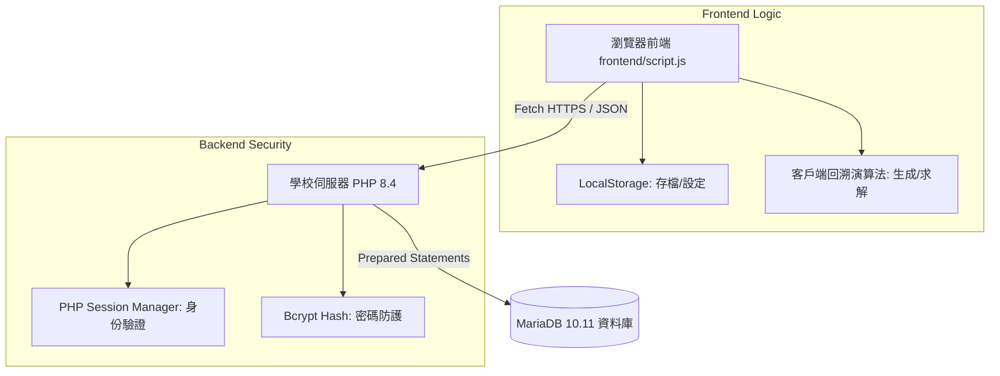
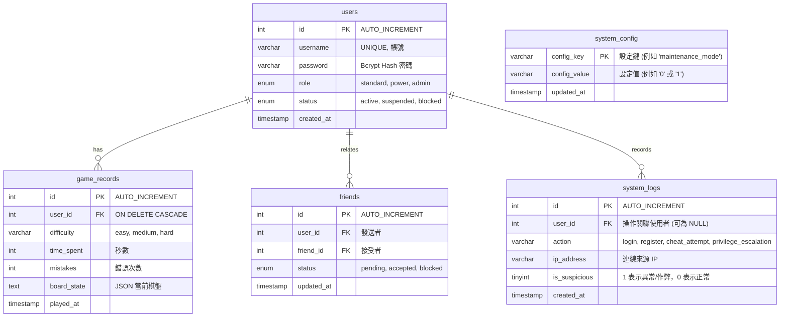

# 系統架構說明書 (SA.md)

## 1. 專案目錄結構 (Folder & Files Architecture)
專案嚴格遵循前後端分離（Separation of Concerns）架構，使前端靜態資源與後端商業邏輯目錄清晰劃分，以便於 FileZilla FTP 部署與管理：

```text
數獨/
├── frontend/               # 前端靜態資源與 UI/UX 目錄
│   ├── index.html          # 數獨主入口 (整合登入彈窗、規則面板、求解器)
│   ├── admin.html          # 🛡️ 數獨安全防護管理系統 v2.0 - 後台主控台
│   ├── style.css           # 包含前台與高級 Glassmorphic 後台專用樣式表
│   ├── script.js           # 前台數獨演算法引擎、Session 動態驗證 UI 邏輯
│   └── admin.js            # 🛡️ 後台控制、分頁切換、用戶/日誌管理交互邏輯
├── backend/                # 後端安全 PHP 業務邏輯目錄
│   ├── db_connect.php      # 嚴格異常報告與 UTF-8 連線配置
│   ├── register.php        # 註冊 API (密碼 Bcrypt 雜湊加密 + 註冊日誌)
│   ├── login.php           # 登入 API (防暴力破解與狀態檢查、維護模式攔截)
│   ├── check_session.php   # Session 狀態檢查 (提供前端 F5 刷新持久化)
│   ├── logout.php          # 登出 API (銷毀 Session)
│   ├── admin_dashboard.php # 🛡️ 後台管理核心 API (權限變更、狀態停用、密碼重設、維護開關)
│   ├── init_admin.php      # 系統最高管理員 Bcrypt 雜湊與表結構升級腳本
│   └── init_db.sql         # 相容 MariaDB 10.11 資料庫初始化腳本
└── doc/                    # 系統規格書目錄 (單一事實來源)
    ├── REQ.md              # 需求規格說明書
    ├── SA.md               # 系統架構說明書
    ├── SD.md               # 系統設計說明書
    └── spec.md             # 開發與部署規範
```

---

## 2. 全端多使用者架構 (Full-Stack Multi-User Architecture)

系統採用經典的 **B/S 架構 (Browser-Server)**。前端透過非同步 `Fetch API` 向後端 PHP 請求 JSON 資料。



---

## 3. 資料庫實體關係模型 (MariaDB 10.11 Database Schema)

為滿足使用者角色權限、好友系統、防作弊、日誌監控與全局一鍵維護需求，資料庫設計如下 5 張核心資料表，使用 `utf8mb4_unicode_ci` 編碼：



### 資料庫完整 SQL 腳本
後端腳本 `backend/init_db.sql` 移除了 `CREATE DATABASE` 的提權語句，以完美相容學校主機無 root 權限的預配專屬同名資料庫環境，所有表可直接建立於 `st111534105`（或對應帳號資料庫）中。

---

## 4. 安全性架構：預處理陳述式 (mysqli Prepared Statements)

為了防範 **SQL 注入漏洞**，後端所有與 MariaDB 的互動 **100% 採用 PHP mysqli 預處理陳述式**。

### 4.1 資料庫連線配置 (`backend/db_connect.php`)
實作安全捕獲 Connection 異常，並向前端隱藏任何涉及伺服器主機的敏感路徑資訊：
```php
<?php
mysqli_report(MYSQLI_REPORT_ERROR | MYSQLI_REPORT_STRICT);
try {
    $conn = new mysqli("localhost", "st111534105", "st111534105", "st111534105");
    $conn->set_charset("utf8mb4");
} catch (Exception $e) {
    header('Content-Type: application/json; charset=utf-8');
    echo json_encode(["status" => "error", "message" => "資料庫連線失敗，請稍後再試。"]);
    exit();
}
?>
```

### 4.2 預處理陳述式寫法範本
```php
$stmt = $conn->prepare("SELECT id, password, role FROM users WHERE username = ?");
$stmt->bind_param("s", $username);
$stmt->execute();
$result = $stmt->get_result();
```

---

## 5. 身份驗證與狀態持久化架構 (Session Management)

本專案採用 **PHP 原生 Session 驗證機制 (`$_SESSION`)** 來維護登入狀態：
1.  **登入成功時**：後端在伺服器寫入用戶 Session：
    ```php
    $_SESSION['user_id'] = $user['id'];
    $_SESSION['username'] = $user['username'];
    $_SESSION['role'] = $user['role'];
    ```
2.  **狀態保留 (F5 刷新)**：前端網頁加載時，自動調用 `backend/check_session.php`。該 API 會檢查當前連線之 Session，若有效則回傳 `{ "logged_in": true, "user": { "username": "...", "role": "..." } }`。
3.  **前端狀態接收與渲染**：
    *   前端收到 Session 資料後，存入變數 `currentUser`。
    *   依據 role 分別套用 `badge-standard` (綠色)、`badge-power` (藍色) 或 `badge-admin` (金色) 漸層配色，以極致奢華的 HSL UI 呈現身份。

---

## 6. 管理員權限防護 (RBAC) 與維護模式架構邏輯 [NEW]

為了保障平台的高安全係數與運行穩定，系統在前後端皆實作了健全的 RBAC 與全域維護模式攔截邏輯：

### 6.1 管理者角色型存取控制 (RBAC 防禦層)
*   **前端權限阻斷**：
    - 當玩家開啟或直接於瀏覽器網址列輸入 `admin.html` 時，頁面在載入時會立即執行 `checkAdminAuth()`。
    - 該函數會非同步請求 `backend/check_session.php`。若回傳的 `role` 欄位不為 `admin` 或未登入，前端會彈出越權存取警示，並自動退回至首頁。
*   **後端 API 二次防禦**：
    - 所有敏感數據的讀寫與管理操作一律導向 `backend/admin_dashboard.php`。
    - 該 API 在入口處即時執行 `session_start()`，並強制比對 `$_SESSION['role'] === 'admin'`。
    - 若驗證失敗，後端將不再執行任何 SQL 或設定變更，直接拋出 `403 Forbidden` 狀態碼並回傳 JSON 錯誤。這提供了雙重保險，有效防止惡意用戶透過工具越權請求。

### 6.2 系統一鍵維護模式 (Maintenance Mode)
*   **全域維護狀態持久化**：
    - 系統維護狀態儲存在 `system_config` 表中，以 `config_key = 'maintenance_mode'` 的紀錄進行管理，其 `config_value` 為 `1` (開啟) 或 `0` (關閉)。
*   **入口攔截流 (PHP Entry Gate)**：
    - 在 [login.php](file:///d:/democase/1/sudoku/backend/login.php) 與前台重要請求 API 中，後端會主動連線至 `system_config` 表查詢 `maintenance_mode`。
    - 若開啟維護模式且嘗試操作的用戶角色不為 `admin`：
      1. 後端立即設定 HTTP 狀態碼為 `503 Service Unavailable`。
      2. 回傳特定 JSON 封包：`{"success": false, "message": "...", "maintenance": true}`。
      3. 前端收到該 JSON 後，會自動阻斷使用者的進一步操作，並將畫面導向乾淨的維護提示看板，僅允許 `admin` 使用者自由登入調試。

