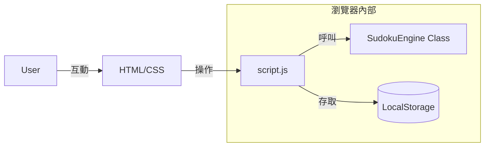

# 系統設計 v2 (SD_v2.md) - 純前端架構版

## 1. 系統架構圖
本系統目前為 **「純靜態單頁應用程式 (Pure Static SPA)」**。

## 2. 模組詳細設計

### 2.1 介面模組
*   **Grid Renderer**: 動態生成 81 個 DOM 元素，負責呈現數獨盤面。
*   **Interactive Tutorial**: 負責高亮相關區域與多步驟引導。

### 2.2 邏輯模組 (SudokuGenerator)
*   **Solver**: 遞迴回溯演算法，負責求解與驗證。
*   **Generator**: 負責題目產出。

## 3. UI/UX 與響應式設計
*   **Mobile First**: 優先確保在手機上的操作流暢度，數字鍵盤佔據底部合適位置。
*   **Dark Mode Support**: 使用 CSS 變數，利於未來擴充深色模式。

## 4. 部署方案
*   **目標環境**: 任何支援 HTTP Server 的空間（包含 `st.sweb.name`）。
*   **步驟**: 使用 FTP/FileZilla 將 `index.html`、`style.css`、`script.js` 上傳至目標目錄即可。
